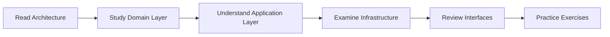

# 🎓 Backend Engineering Learning Guide

> **Transform your backend skills from junior to senior by studying this production-grade codebase**

This guide will teach you how to build **enterprise-grade backends** through a real implementation that demonstrates industry best practices, sophisticated patterns, and professional engineering principles.

## 📚 Table of Contents

1. [Learning Path Overview](#learning-path-overview)
2. [Architecture Foundations](#architecture-foundations)
3. [Domain-Driven Design Mastery](#domain-driven-design-mastery)
4. [CQRS & Event Sourcing](#cqrs--event-sourcing)
5. [Infrastructure Patterns](#infrastructure-patterns)
6. [Code Quality & Craftsmanship](#code-quality--craftsmanship)
7. [Production Readiness](#production-readiness)
8. [Study Exercises](#study-exercises)

---

## 🎯 Learning Path Overview

### Who This Guide Is For
- **Mid-level developers** wanting to level up to senior
- **Senior developers** wanting to validate their practices
- **Tech leads** establishing team standards
- **Architects** reviewing pattern implementations

### What You'll Learn
- ✅ How to implement **Domain-Driven Design** correctly
- ✅ **CQRS** and **Event Sourcing** patterns in practice
- ✅ Building **maintainable** and **testable** code
- ✅ **Enterprise patterns** that actually work
- ✅ **Go best practices** for large-scale systems

### How to Use This Guide



---

## 🏗️ Architecture Foundations

### Start Here: Understanding the Structure

```
backend/
├── domain/           # Business logic lives here
├── application/      # Use cases and orchestration
├── infrastructure/   # External world interaction
├── interfaces/       # API and entry points
└── pkg/             # Shared utilities
```

### 📖 **Lesson 1: Clean Architecture**

**File to Study**: `infrastructure/di/container.go`

```go
// This demonstrates Dependency Inversion Principle
// Domain doesn't depend on infrastructure
type Container struct {
    Config     *config.Config
    NodeRepo   ports.NodeRepository  // Interface, not concrete
    GraphRepo  ports.GraphRepository
    EdgeRepo   ports.EdgeRepository
}
```

**Key Learning**:
- Interfaces define contracts in the domain
- Implementations live in infrastructure
- Dependencies flow inward (infrastructure → application → domain)

### 📖 **Lesson 2: Hexagonal Architecture**

**Files to Study**:
1. `application/ports/` - All interfaces (ports)
2. `infrastructure/persistence/` - Implementations (adapters)

**What to Notice**:
```go
// Port (domain defines what it needs)
type NodeRepository interface {
    Save(ctx context.Context, node *entities.Node) error
    GetByID(ctx context.Context, id valueobjects.NodeID) (*entities.Node, error)
}

// Adapter (infrastructure provides implementation)
type DynamoDBNodeRepository struct {
    client *dynamodb.Client
    // Implementation details hidden from domain
}
```

---

## 👑 Domain-Driven Design Mastery

### 📖 **Lesson 3: Aggregates**

**File to Study**: `domain/core/aggregates/graph.go`

```go
type Graph struct {
    id       GraphID                          // Identity
    userID   string                          // Owner
    nodes    map[valueobjects.NodeID]*entities.Node  // Consistency boundary
    edges    map[string]*Edge
    metadata GraphMetadata
    events   []events.DomainEvent            // Domain events
}

// Business logic encapsulated
func (g *Graph) AddNode(node *entities.Node) error {
    // Invariants protected here
    if g.NodeCount() >= g.config.MaxNodesPerGraph {
        return NewDomainError("maximum nodes reached")
    }

    g.nodes[node.ID()] = node
    g.RaiseDomainEvent(events.NewNodeAdded(g.id, node.ID()))
    return nil
}
```

**Key Learnings**:
- **Aggregate Root** controls access to entities
- **Invariants** are protected within aggregate
- **Domain Events** capture what happened
- **Consistency Boundary** - what must be consistent

### 📖 **Lesson 4: Value Objects**

**File to Study**: `domain/core/valueobjects/node_content.go`

```go
// Value Objects are immutable and self-validating
type NodeContent struct {
    title  string  // Private fields
    body   string
    format ContentFormat
}

// Constructor ensures validity
func NewNodeContent(title, body string) (NodeContent, error) {
    if title == "" {
        return NodeContent{}, NewValidationError("title required")
    }

    return NodeContent{
        title: title,
        body:  body,
        format: FormatMarkdown,
    }, nil
}

// Behavior lives with data
func (c NodeContent) Summary(maxLength int) string {
    // Rich behavior in value object
    content := c.title
    if len(c.body) > 0 {
        content += ": " + c.body
    }

    if len(content) > maxLength {
        return content[:maxLength] + "..."
    }
    return content
}
```

**Key Learnings**:
- **Immutability** through private fields
- **Self-validation** in constructors
- **Rich behavior** methods
- **No identity** - equality by value

### 📖 **Lesson 5: Entities**

**File to Study**: `domain/core/entities/node.go`

```go
// Entities have identity and lifecycle
type Node struct {
    id        valueobjects.NodeID     // Identity
    content   valueobjects.NodeContent // Uses value objects
    position  valueobjects.Position
    metadata  NodeMetadata
    version   int                     // For optimistic locking
    events    []events.DomainEvent
}

// Business operations
func (n *Node) UpdateContent(content valueobjects.NodeContent) error {
    oldContent := n.content
    n.content = content
    n.version++

    // Raise domain event
    n.events = append(n.events, events.NewNodeContentUpdated(
        n.id, oldContent, content,
    ))

    return nil
}
```

**Key Learnings**:
- **Identity** remains constant
- **Mutable state** with version tracking
- **Encapsulated operations** with business meaning
- **Domain events** for state changes

### 📖 **Lesson 6: Domain Services**

**File to Study**: `domain/services/graph_validation_service.go`

```go
// Domain services for logic that spans multiple aggregates
type GraphValidationService struct {
    config *config.DomainConfig
}

// Cross-aggregate business logic
func (s *GraphValidationService) ValidateNodeConnection(
    sourceNode *entities.Node,
    targetNode *entities.Node,
    edge *aggregates.Edge,
) error {
    // Business rules that don't belong to single aggregate
    if sourceNode.UserID() != targetNode.UserID() {
        return NewDomainError("cannot connect nodes from different users")
    }

    if edge.Weight() < s.config.MinEdgeWeight {
        return NewValidationError("edge weight below minimum")
    }

    return nil
}
```

---

## 📊 CQRS & Event Sourcing

### 📖 **Lesson 7: Command Handlers (Create Node Saga)**

**Files to Study**:
- `application/commands/handlers/create_node_saga_handler.go`
- `application/sagas/create_node_saga.go`
- `infrastructure/di/providers.go`

```go
// Saga handler is the live path.
type CreateNodeSagaHandler struct {
    saga           *sagas.CreateNodeSaga
    operationStore ports.OperationStore
    logger         *zap.Logger
}

func (h *CreateNodeSagaHandler) Handle(ctx context.Context, cmd commands.CreateNodeCommand) error {
    operationID := uuid.New().String()
    sagaData := &sagas.CreateNodeSagaData{
        UserID:      cmd.UserID,
        Title:       cmd.Title,
        Content:     cmd.Content,
        Tags:        cmd.Tags,
        X:           cmd.X,
        Y:           cmd.Y,
        Z:           cmd.Z,
        OperationID: operationID,
        StartTime:   time.Now(),
    }

    return h.saga.Execute(ctx, sagaData)
}
```

```go
// Saga coordinates multi-step node creation with compensations.
func (cns *CreateNodeSaga) BuildSaga(operationID string) *Saga {
    return NewSagaBuilder("CreateNode", cns.logger).
        WithStep("ValidateInput", cns.validateInput).
        WithCompensableStep("BeginTransaction", cns.beginTransaction, cns.rollbackTransaction).
        WithCompensableStep("EnsureGraph", cns.ensureGraph, cns.compensateGraph).
        WithCompensableStep("CreateNode", cns.createNode, cns.compensateNode).
        WithCompensableStep("SaveNode", cns.saveNode, cns.compensateSaveNode).
        WithRetryableStep("DiscoverEdges", cns.discoverEdges, 3, 2*time.Second).
        WithCompensableStep("CreateSyncEdges", cns.createSyncEdges, cns.compensateEdges).
        WithCompensableStep("UpdateGraph", cns.updateGraph, cns.compensateGraphUpdate).
        WithStep("CommitTransaction", cns.commitTransaction).
        WithRetryableStep("PublishEvents", cns.publishEvents, 3, 1*time.Second).
        WithStep("UpdateMetadata", cns.updateMetadata).
        Build()
}
```

**Key Learnings**:
- The saga handler is the sole live path now; the orchestrator remains only as a documented legacy reference.
- Saga steps split the operation into compensable units with retries and explicit rollback hooks.
- Operation tracking (via `OperationStore`) and edge discovery live inside the saga data, enabling progress reporting.

### 📖 **Lesson 8: Query Handlers**

**File to Study**: `application/queries/handlers/get_node_handler.go`

```go
// Queries read state without modifying
type GetNodeHandler struct {
    nodeRepo ports.NodeRepository
    logger   *zap.Logger
}

func (h *GetNodeHandler) Handle(
    ctx context.Context,
    query queries.GetNodeQuery,
) (*queries.GetNodeResult, error) {
    // Direct read from read model
    node, err := h.nodeRepo.GetByID(ctx, query.NodeID)
    if err != nil {
        return nil, err
    }

    // Transform to DTO
    return &queries.GetNodeResult{
        ID:       node.ID().String(),
        Title:    node.Content().Title(),
        Content:  node.Content().Body(),
        Position: node.Position().ToDTO(),
    }, nil
}
```

**Key Learnings**:
- **Queries** never modify state
- **Read models** optimized for queries
- **DTOs** for data transfer
- **No domain logic** in queries

### 📖 **Lesson 9: Saga Pattern**

**File to Study**: `application/sagas/create_node_saga.go`

```go
// Sagas manage distributed transactions
type CreateNodeSaga struct {
    steps []SagaStep
}

type SagaStep interface {
    Execute(ctx context.Context, data *CreateNodeSagaData) error
    Compensate(ctx context.Context, data *CreateNodeSagaData) error
}

func (s *CreateNodeSaga) Execute(ctx context.Context) error {
    data := &CreateNodeSagaData{}

    // Execute each step
    for i, step := range s.steps {
        if err := step.Execute(ctx, data); err != nil {
            // Compensate in reverse order
            for j := i - 1; j >= 0; j-- {
                s.steps[j].Compensate(ctx, data)
            }
            return err
        }
    }

    return nil
}
```

**Key Learnings**:
- **Distributed transactions** across aggregates
- **Compensation** for rollback
- **State tracking** through saga data
- **Orchestration** vs choreography

---

## 🔧 Infrastructure Patterns

### 📖 **Lesson 10: Repository Pattern**

**File to Study**: `infrastructure/persistence/dynamodb/generic_repository.go`

```go
// Generic repository eliminates duplication
type GenericRepository[T Entity] struct {
    client *dynamodb.Client
    config EntityConfig[T]
}

// Strategy pattern for entity-specific behavior
type EntityConfig[T Entity] interface {
    TableName() string
    ToItem(entity T) (map[string]types.AttributeValue, error)
    ParseItem(item map[string]types.AttributeValue) (T, error)
}

func (r *GenericRepository[T]) Save(ctx context.Context, entity T) error {
    // Convert to DynamoDB item
    item, err := r.config.ToItem(entity)
    if err != nil {
        return err
    }

    // Optimistic locking
    if entity.GetVersion() > 1 {
        item["Version"] = &types.AttributeValueMemberN{
            Value: strconv.Itoa(entity.GetVersion()),
        }

        // Condition: version must match
        condition := expression.Name("Version").Equal(
            expression.Value(entity.GetVersion() - 1),
        )
    }

    // Save with condition
    _, err = r.client.PutItem(ctx, &dynamodb.PutItemInput{
        TableName:           aws.String(r.config.TableName()),
        Item:               item,
        ConditionExpression: condition.Builder().Build(),
    })

    return err
}
```

**Key Learnings**:
- **Generics** for code reuse
- **Strategy pattern** for customization
- **Optimistic locking** for concurrency
- **Clean separation** from domain

### 📖 **Lesson 11: Unit of Work**

**File to Study**: `infrastructure/persistence/dynamodb/unit_of_work.go`

```go
// Tracks changes and commits atomically across repositories
type DynamoDBUnitOfWork struct {
    client         *dynamodb.Client
    transactItems  []types.TransactWriteItem
    pendingEvents  []events.DomainEvent
    rollbackActions []func() error
    inTransaction  bool
}

func (uow *DynamoDBUnitOfWork) Begin(ctx context.Context) error {
    if uow.inTransaction {
        return fmt.Errorf("transaction already in progress")
    }
    uow.inTransaction = true
    uow.Clear()
    return nil
}

func (uow *DynamoDBUnitOfWork) RegisterSave(item types.TransactWriteItem) error {
    if !uow.inTransaction {
        return fmt.Errorf("no transaction in progress")
    }
    uow.transactItems = append(uow.transactItems, item)
    return nil
}

func (uow *DynamoDBUnitOfWork) Commit(ctx context.Context) error {
    // Adds pending event items (when supported) and executes a TransactWriteItems call.
    // Events are persisted with "pending" status; an outbox processor publishes them later.
}
```

**Key Learnings**:
- `Begin(ctx)`/`Commit(ctx)` guard the transaction boundary—always handle their errors.
- Repositories build `types.TransactWriteItem` payloads and pass them via `RegisterSave`/`RegisterDelete` (older `RegisterNew` APIs are gone).
- Domain events are staged inside the same transaction, but publishing now happens asynchronously via the outbox processor.

### 📖 **Lesson 12: Event Store**

**File to Study**: `infrastructure/persistence/dynamodb/event_store.go`

```go
// Event sourcing infrastructure
type DynamoDBEventStore struct {
    client  *dynamodb.Client
    table   string
    outbox  *OutboxProcessor
}

func (es *DynamoDBEventStore) SaveEvents(
    ctx context.Context,
    aggregateID string,
    events []events.DomainEvent,
    expectedVersion int,
) error {
    var transactItems []types.TransactWriteItem

    for i, event := range events {
        // Event as immutable record
        item := map[string]types.AttributeValue{
            "PK":        {S: aws.String(fmt.Sprintf("EVENT#%s", aggregateID))},
            "SK":        {S: aws.String(fmt.Sprintf("%d#%s", expectedVersion+i, event.ID()))},
            "EventType": {S: aws.String(event.Type())},
            "Payload":   {S: aws.String(event.JSON())},
            "Timestamp": {S: aws.String(event.OccurredAt().Format(time.RFC3339))},
        }

        transactItems = append(transactItems, types.TransactWriteItem{
            Put: &types.Put{
                TableName: aws.String(es.table),
                Item:     item,
            },
        })

        // Add to outbox for reliable publishing
        es.outbox.Add(event)
    }

    // Atomic write
    return es.client.TransactWriteItems(ctx, &dynamodb.TransactWriteItemsInput{
        TransactItems: transactItems,
    })
}
```

---

## 💎 Code Quality & Craftsmanship

### 📖 **Lesson 13: Error Handling**

**File to Study**: `pkg/errors/errors.go`

```go
// Rich error types with context
type AppError struct {
    Type       ErrorType
    Message    string
    Code       string
    Details    map[string]interface{}
    HTTPStatus int
    cause      error
    stackTrace []byte
}

// Fluent interface for error building
func NewValidationError(message string) *AppError {
    return &AppError{
        Type:       ErrorTypeValidation,
        Message:    message,
        HTTPStatus: http.StatusBadRequest,
        stackTrace: debug.Stack(),
    }
}

func (e *AppError) WithDetails(details map[string]interface{}) *AppError {
    e.Details = details
    return e
}

func (e *AppError) WithCode(code string) *AppError {
    e.Code = code
    return e
}

// Error wrapping
func (e *AppError) Wrap(cause error) *AppError {
    e.cause = cause
    return e
}
```

**Key Learnings**:
- **Rich error types** not just strings
- **Stack traces** for debugging
- **Fluent builders** for ergonomics
- **Error wrapping** preserves context

### 📖 **Lesson 14: Dependency Injection**

**File to Study**: `infrastructure/di/providers.go`

```go
// Wire-based dependency injection
func ProvideNodeRepository(
    client *dynamodb.Client,
    config *config.Config,
) ports.NodeRepository {
    return dynamodb.NewNodeRepository(client, config)
}

func ProvideCreateNodeHandler(
    repo ports.NodeRepository,
    eventBus ports.EventPublisher,
    logger *zap.Logger,
) *handlers.CreateNodeHandler {
    return handlers.NewCreateNodeHandler(repo, eventBus, logger)
}

// Wire automatically connects dependencies
var ContainerSet = wire.NewSet(
    ProvideConfig,
    ProvideDynamoDBClient,
    ProvideNodeRepository,
    ProvideCreateNodeHandler,
    // ... more providers
)
```

**Key Learnings**:
- **Constructor injection** over field injection
- **Interface dependencies** not concrete
- **Compile-time safety** with Wire
- **Single responsibility** providers

### 📖 **Lesson 15: Configuration Management**

**File to Study**: `infrastructure/config/config.go`

```go
// Structured configuration with validation
type Config struct {
    // Environment
    Environment string `validate:"required,oneof=dev staging prod"`

    // Feature flags
    Features Features

    // AWS settings
    AWS AWSConfig `validate:"required"`

    // Domain limits
    Domain DomainConfig
}

// Validation on load
func LoadConfig() (*Config, error) {
    cfg := &Config{
        Environment: getEnv("ENVIRONMENT", "dev"),
        // Feature flags such as async deletion are loaded here.
    }

    // Validate configuration
    if err := validate.Struct(cfg); err != nil {
        return nil, fmt.Errorf("invalid config: %w", err)
    }

    return cfg, nil
}
```

---

## 🚀 Production Readiness

### 📖 **Lesson 16: Middleware Chain**

**File to Study**: `interfaces/http/rest/router.go`

```go
router := chi.NewRouter()

router.Use(chimiddleware.RequestID)
router.Use(chimiddleware.RealIP)
router.Use(chimiddleware.Recoverer)
router.Use(middleware.Logger(rt.logger))
router.Use(versionMiddleware)

router.Use(cors.Handler(cors.Options{ /* ... */ }))

router.Route("/api/v1", func(r chi.Router) {
    r.Use(authMiddleware) // injected via DI
    // register handlers...
})
```

**Key Learnings**:
- Chi's `router.Use` handles middleware composition; the bespoke `Chain` helper is gone.
- The logging middleware wraps the shared zap logger, surfacing request ID, latency, and user agent.
- Route-scoped middleware keeps cross-cutting concerns targeted (auth only on `/api/v1`, for example).
- Auth middleware is built once in DI, so expensive dependencies (JWT validator, rate limiters) are shared.

### 📖 **Lesson 17: Graceful Shutdown**

**File to Study**: `cmd/api/main.go`

```go
func main() {
    // Setup
    container := setupContainer()
    server := setupServer(container)

    // Graceful shutdown
    stop := make(chan os.Signal, 1)
    signal.Notify(stop, os.Interrupt, syscall.SIGTERM)

    go func() {
        if err := server.ListenAndServe(); err != nil {
            log.Fatal(err)
        }
    }()

    <-stop

    // Cleanup
    ctx, cancel := context.WithTimeout(context.Background(), 10*time.Second)
    defer cancel()

    // Drain connections
    if err := server.Shutdown(ctx); err != nil {
        log.Fatal(err)
    }

    // Close resources
    container.Cleanup()
}
```

---

## 🏋️ Study Exercises

### Exercise 1: Add a New Aggregate
**Goal**: Understand aggregate design

1. Create a new `Tag` aggregate in `domain/core/aggregates/`
2. Define invariants (e.g., unique tag names per user)
3. Add domain events for tag operations
4. Implement repository interface in `application/ports/`
5. Create DynamoDB implementation

### Exercise 2: Implement a New Saga
**Goal**: Master distributed transactions

1. Create `BulkImportSaga` for importing multiple nodes
2. Define compensation for each step
3. Handle partial failures
4. Implement progress tracking
5. Add timeout handling

### Exercise 3: Add Query Optimization
**Goal**: Understand CQRS read models

1. Create a denormalized view for graph statistics
2. Update view on domain events
3. Implement efficient query handler
4. Add caching strategy
5. Measure performance improvement

### Exercise 4: Extend Error Handling
**Goal**: Master error design

1. Add new error type for rate limiting
2. Implement exponential backoff
3. Add circuit breaker pattern
4. Create error aggregation for batch operations
5. Implement error recovery strategies

### Exercise 5: Build New Repository
**Goal**: Understand persistence patterns

1. Implement Redis repository for caching
2. Use generic repository as base
3. Add TTL support
4. Implement cache invalidation
5. Add metrics for cache hit/miss

---

## 📋 Code Review Checklist

When reviewing code in this project, check:

### Domain Layer
- [ ] Aggregates protect invariants
- [ ] Value objects are immutable
- [ ] Domain events capture business meaning
- [ ] No infrastructure dependencies

### Application Layer
- [ ] Commands modify state
- [ ] Queries only read
- [ ] Sagas handle failures
- [ ] Use cases are focused

### Infrastructure Layer
- [ ] Repositories hide persistence details
- [ ] Proper transaction handling
- [ ] Error mapping to domain errors
- [ ] Resource cleanup

### General Quality
- [ ] Methods under 50 lines
- [ ] Interfaces are focused
- [ ] Dependencies injected
- [ ] Errors handled explicitly
- [ ] Tests cover business logic

---

## 🎯 Mastery Path

### Level 1: Understanding (1-2 weeks)
- Read through entire codebase
- Understand layer responsibilities
- Identify patterns in use

### Level 2: Modification (2-4 weeks)
- Add new features
- Fix hypothetical bugs
- Refactor complex methods

### Level 3: Extension (1-2 months)
- Add new aggregates
- Implement new patterns
- Optimize performance

### Level 4: Architecture (2-3 months)
- Design new bounded contexts
- Plan microservice extraction
- Implement new infrastructure adapters

---

## 🔗 Additional Resources

### Books to Read
- **Domain-Driven Design** by Eric Evans
- **Implementing Domain-Driven Design** by Vaughn Vernon
- **Clean Architecture** by Robert Martin
- **Building Microservices** by Sam Newman

### Patterns to Study
- **Aggregate Pattern** - consistency boundaries
- **Repository Pattern** - persistence abstraction
- **Unit of Work** - transaction management
- **Saga Pattern** - distributed transactions
- **CQRS** - command query separation
- **Event Sourcing** - audit and replay

### Go-Specific Resources
- **Effective Go** - official style guide
- **Go Concurrency Patterns** - Rob Pike's talks
- **Wire** - dependency injection
- **Go Generics** - type-safe code reuse

---

## 🎓 Certification Path

After studying this codebase, you should be able to:

### Junior → Mid-Level
- ✅ Understand layer separation
- ✅ Implement basic CRUD operations
- ✅ Write testable code
- ✅ Use dependency injection

### Mid-Level → Senior
- ✅ Design aggregates with invariants
- ✅ Implement complex business logic
- ✅ Handle distributed transactions
- ✅ Optimize performance

### Senior → Staff/Principal
- ✅ Design bounded contexts
- ✅ Plan system architecture
- ✅ Implement cross-cutting concerns
- ✅ Mentor others using this codebase

---

## 💡 Pro Tips

1. **Start with domain** - Business logic is the heart
2. **Follow the data flow** - Request → Handler → Service → Repository
3. **Understand transactions** - Unit of Work ensures consistency
4. **Learn from tests** - They show intended usage
5. **Trace events** - Follow domain events through the system

---

## 🤝 Contributing to Learning

If you find ways to improve this codebase as a teaching tool:

1. **Add comments** explaining complex patterns
2. **Create examples** of pattern usage
3. **Write guides** for specific concepts
4. **Share learnings** with the community

---

## 📧 Questions?

This codebase is designed to teach. If something isn't clear:

1. Check if there's a test demonstrating usage
2. Look for similar patterns elsewhere in the code
3. Consult the pattern's original documentation
4. Remember: Production code is the best teacher

---

## 🧠 Fundamental Concepts for Software Engineers

### Understanding Core Concepts

#### **Procedural vs Object-Oriented Programming**

**Procedural Code (How NOT to do it):**
```go
// ❌ Data and behavior are separated
type Node struct {
    ID       string
    Title    string
    Content  string
}

// Functions operate ON data
func UpdateNodeContent(node *Node, newContent string) {
    node.Content = newContent  // No validation!
}

// Problem: Anyone can modify fields directly
node.Content = "bypassed all validation!"
```

**Object-Oriented Code (Proper encapsulation):**
```go
// ✅ Data and behavior are together
type Node struct {
    id       NodeID      // Private fields
    content  NodeContent // Protected from direct access
}

// Methods belong TO the object
func (n *Node) UpdateContent(content NodeContent) error {
    if err := n.validateContent(content); err != nil {
        return err
    }
    n.content = content
    n.version++
    return nil
}
// Now you CAN'T bypass validation - fields are private
```

#### **Aggregates and Invariants Explained**

**What's an Invariant?**
An invariant is a business rule that must ALWAYS be true.

```go
// INVARIANT: Account balance cannot go below zero
type BankAccount struct {
    balance Money  // Private to protect invariant
}

func (a *BankAccount) Withdraw(amount Money) error {
    // PROTECTING THE INVARIANT
    if a.balance.LessThan(amount) {
        return ErrInsufficientFunds
    }
    a.balance = a.balance.Subtract(amount)
    return nil
}
```

**What's an Aggregate?**
A cluster of objects treated as a single unit to maintain consistency.

```go
// AGGREGATE: Graph maintains consistency of nodes and edges
type Graph struct {
    nodes    map[NodeID]*Node
    edges    map[EdgeID]*Edge
    maxNodes int
}

// Aggregate ensures business rules are never violated
func (g *Graph) AddNode(node *Node) error {
    // INVARIANT: Cannot exceed max nodes
    if len(g.nodes) >= g.maxNodes {
        return ErrGraphFull
    }

    g.nodes[node.ID] = node
    g.raiseEvent(NodeAdded{GraphID: g.id, NodeID: node.ID})
    return nil
}
```

#### **Extensibility and the Open/Closed Principle**

**Extensibility** means adding features WITHOUT modifying existing code.

**❌ Not Extensible:**
```go
func ProcessPayment(method string, amount float64) error {
    if method == "credit_card" {
        // credit card logic
    } else if method == "paypal" {
        // paypal logic
    }
    // To add Bitcoin, must modify this function
}
```

**✅ Extensible:**
```go
// Define interface
type PaymentProcessor interface {
    Process(amount Money) error
}

// Add new payment methods without changing existing code
type BitcoinProcessor struct{}
func (b BitcoinProcessor) Process(amount Money) error {
    // Bitcoin implementation
}

// Original function never changes
func ProcessPayment(processor PaymentProcessor, amount Money) error {
    return processor.Process(amount)
}
```

#### **Saga Pattern and Distributed Transactions**

**Problem**: Can't use database transactions across services
**Solution**: Saga with compensating transactions

```go
// Example: Order processing saga
type OrderSaga struct {
    steps []SagaStep
}

type SagaStep interface {
    Execute() error
    Compensate() error  // Undo if later steps fail
}

// If step 3 fails, compensate steps 2 and 1
func (saga *OrderSaga) Execute() error {
    completed := []SagaStep{}

    for _, step := range saga.steps {
        if err := step.Execute(); err != nil {
            // Rollback in reverse order
            for i := len(completed) - 1; i >= 0; i-- {
                completed[i].Compensate()
            }
            return err
        }
        completed = append(completed, step)
    }
    return nil
}
```

---

## 📚 Comprehensive Learning Resources

### **Domain-Driven Design Resources**

#### Books
1. **[Domain-Driven Design Distilled](https://www.amazon.com/Domain-Driven-Design-Distilled-Vaughn-Vernon/dp/0134434420)** - Vaughn Vernon
   - Best introduction to DDD
   - Focus on aggregates and bounded contexts

2. **[Implementing Domain-Driven Design](https://www.amazon.com/Implementing-Domain-Driven-Design-Vaughn-Vernon/dp/0321834577)** - Vaughn Vernon
   - Practical implementation guide
   - Real-world examples

#### Online Resources
- **[DDD Europe YouTube](https://www.youtube.com/c/dddeurope)** - Free conference talks
- **[Martin Fowler's DDD Articles](https://martinfowler.com/tags/domain%20driven%20design.html)** - Essential reading
- **[DDD Community](http://dddcommunity.org/)** - Resources and discussions

### **Saga Pattern and Orchestration**

#### Essential Reading
- **[Microservices.io Saga Pattern](https://microservices.io/patterns/data/saga.html)** - Best free resource
- **[AWS Step Functions](https://aws.amazon.com/step-functions/)** - Practical implementation
- **[Temporal Documentation](https://docs.temporal.io/)** - Modern workflow engine

#### Video Resources
- **[Saga Pattern Explained](https://www.youtube.com/watch?v=YPbGW3Fnmbc)** - Visual explanation
- **[Event-Driven Saga](https://www.youtube.com/watch?v=kyNL7yCvQQc)** - Implementation patterns

### **CQRS and Event Sourcing**

#### Comprehensive Guides
- **[Event Store Docs](https://www.eventstore.com/event-sourcing)** - Complete guide
- **[CQRS Journey](https://docs.microsoft.com/en-us/previous-versions/msp-n-p/jj554200(v=pandp.10))** - Microsoft's free book
- **[Greg Young's CQRS Documents](https://cqrs.files.wordpress.com/2010/11/cqrs_documents.pdf)** - Original CQRS paper

### **Go-Specific Backend Resources**

#### Books
1. **[Let's Go Further](https://lets-go-further.alexedwards.net/)** - Production-ready APIs
2. **[Go Design Patterns](https://www.amazon.com/Go-Design-Patterns-Mario-Castro/dp/1786466201)** - Pattern implementation

#### Online Learning
- **[GoByExample](https://gobyexample.com/)** - Quick reference
- **[Effective Go](https://golang.org/doc/effective_go.html)** - Official best practices
- **[Go Blog](https://blog.golang.org/)** - Advanced topics

### **System Design and Architecture**

#### Must-Read Books
1. **[Clean Architecture](https://www.amazon.com/Clean-Architecture-Craftsmans-Software-Structure/dp/0134494164)** - Robert Martin
2. **[Building Microservices](https://www.amazon.com/Building-Microservices-Sam-Newman/dp/1492034029)** - Sam Newman
3. **[Designing Data-Intensive Applications](https://www.amazon.com/Designing-Data-Intensive-Applications-Reliable-Maintainable/dp/1449373321)** - Martin Kleppmann

#### Online Courses
- **[System Design Primer](https://github.com/donnemartin/system-design-primer)** - Free GitHub resource
- **[Microservices with Go](https://www.udemy.com/course/microservices-with-go/)** - Practical course
- **[Event-Driven Architecture](https://www.confluent.io/learn/event-driven-architecture/)** - Confluent's guide

---

## 🎯 Realistic Career Progression - Tehcnila aspects

### **What This Backend Teaches You**

#### **Junior → Mid-Level (Highly Achievable)**
**Timeline**: 3-6 months of dedicated study

You'll master:
- Writing testable, maintainable code
- Understanding design patterns in context
- Implementing repositories and services
- Proper error handling
- Clean architecture principles

#### **Mid-Level → Senior (Achievable)**
**Timeline**: 6-12 months of study + application

You'll understand:
- Designing aggregates with invariants
- Implementing distributed transactions
- Making architectural trade-offs
- Performance optimization strategies
- Complex pattern implementation

#### **Senior → Staff (Partial Foundation)**
**Timeline**: Not directly achievable through code study alone

This provides foundation for:
- System design principles
- Pattern selection criteria
- Code quality standards

**Still需要**: Real-world experience with scale, team leadership, cross-service architecture

---

## 🧭 Quick Reference: Mental Models

### **Core Concepts in Simple Terms**

**Aggregate**: Think "consistency boundary" - like a bank account ensuring no overdrafts

**Invariant**: Rules that can NEVER break - "inventory can't be negative"

**Saga**: Recipe with undo instructions - if step 5 fails, undo steps 1-4

**Repository**: Storage abstraction - swap databases without changing business logic

**Value Object**: Immutable data with behavior - like Money that knows how to add itself

**Entity**: Has identity and lifecycle - like User with unique ID

**Domain Event**: "Something happened" - NodeCreated, PaymentProcessed

**CQRS**: Separate paths for reading and writing - like having different doors for entry/exit

**Event Sourcing**: Store history not state - like bank statement vs balance

**Unit of Work**: Transaction tracker - ensures all-or-nothing saves

---

## 🚀 Accelerated Learning Path

### **Week 1-2: Fundamentals**
- Study the domain layer structure
- Understand aggregates in `domain/core/aggregates/`
- Trace a request through all layers

### **Week 3-4: Patterns**
- Study saga implementation in `application/sagas/`
- Understand CQRS in `application/commands/` and `queries/`
- Review repository pattern in `infrastructure/persistence/`

### **Week 5-6: Build**
- Add a new aggregate
- Implement a new saga
- Create custom repository

### **Week 7-8: Optimize**
- Add caching layer
- Implement batch operations
- Optimize query performance

---

## 💪 Engineering Wisdom from This Codebase

### **Key Lessons for Professional Development**

1. **Protect Your Invariants**
   - Never trust external input
   - Validate at boundaries
   - Encapsulate business rules

2. **Design for Change**
   - Use interfaces, not concrete types
   - Apply dependency inversion
   - Keep coupling loose

3. **Make Wrong Code Impossible**
   - Use types to enforce correctness
   - Private fields prevent misuse
   - Compile-time safety over runtime checks

4. **Optimize for Understanding**
   - Clear names over clever code
   - Explicit over implicit
   - Small functions doing one thing

5. **Plan for Failure**
   - Every operation can fail
   - Design compensating actions
   - Log enough to debug production

6. **Performance Follows Design**
   - Clean architecture enables optimization
   - Measure before optimizing
   - Cache at the right level

### **Questions to Ask Yourself**

When designing systems, ask:
- "What invariants must I protect?"
- "What happens when this fails?"
- "How will this scale to 10x load?"
- "Can I test this in isolation?"
- "Will another developer understand this?"

### **Signs You're Growing**

You know you're improving when:
- You think in patterns, not just code
- You consider failure cases first
- You design interfaces before implementations
- You can explain "why" not just "how"
- You see trade-offs, not perfect solutions

---

## 🎓 Final Advice

**For Juniors**: Focus on understanding WHY patterns exist, not just HOW to implement them. This codebase shows the "why" through real usage.

**For Mid-Levels**: Study the architectural decisions. Why saga over 2PC? Why CQRS here? Understanding trade-offs makes you senior.

**For Seniors**: Look for teaching opportunities. This codebase can help you mentor others and establish team standards.

**Remember**: The best engineers aren't those who know the most patterns, but those who know when to use them.

---

*"The best way to learn backend engineering is to study production-grade code. This codebase provides that opportunity with clean architecture, sophisticated patterns, and professional practices. Study it, understand it, and apply these patterns in your own work."*

**Happy Learning! 🚀**
