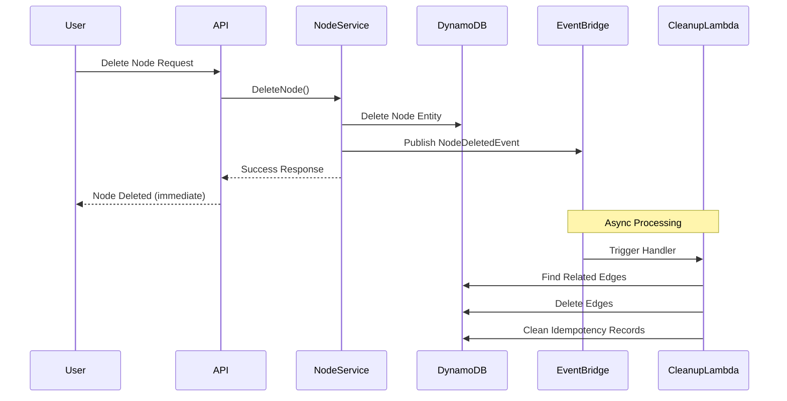

# Async Cleanup Architecture for Node Deletion

## Overview

This document describes the event-driven, asynchronous cleanup architecture implemented for node deletion in Brain2. When users delete nodes through the console, the nodes are immediately removed from the user's view, while related resources (edges, idempotency records) are cleaned up asynchronously in the background.

## Problem Statement

Previously, when nodes were deleted:
- Only the node entity itself was removed from DynamoDB
- Related edges remained as orphaned entities
- Idempotency records persisted unnecessarily
- This led to data inconsistency and storage waste

## Solution Architecture

### Components

1. **Node Service** (`internal/application/services/node_service.go`)
   - Handles synchronous node deletion
   - Publishes `NodeDeletedEvent` to EventBridge
   - Returns immediately to provide fast user feedback

2. **Cleanup Lambda Handler** (`cmd/cleanup-handler/main.go`)
   - Triggered by EventBridge on `NodeDeleted` events
   - Processes cleanup asynchronously
   - Handles both single and bulk deletions

3. **Cleanup Service** (`internal/application/services/cleanup_service.go`)
   - Core business logic for resource cleanup
   - Removes edges where deleted node is source or target
   - Cleans up idempotency records
   - Handles canonical edge storage patterns

4. **EventBridge Integration**
   - Event Bus: `B2EventBus`
   - Source: `brain2-backend`
   - Event Type: `NodeDeleted`
   - Includes retry logic and dead letter queue support

### Event Flow



### DynamoDB Edge Storage Pattern

Edges are stored with the following key structure:
- **PK**: `USER#<userId>#NODE#<nodeId>`
- **SK**: `EDGE#RELATES_TO#<targetNodeId>`
- **GSI2PK**: `USER#<userId>#EDGE`
- **GSI2SK**: `NODE#<sourceId>#TARGET#<targetId>`

The cleanup process queries both directions to ensure all edges are removed.

## Implementation Details

### Lambda Configuration

```typescript
// CDK Configuration (infra/lib/stacks/compute-stack.ts)
this.cleanupLambda = new lambda.Function(this, 'CleanupLambda', {
  runtime: lambda.Runtime.PROVIDED_AL2,
  handler: 'bootstrap',
  memorySize: 256,              // More memory for batch operations
  timeout: Duration.seconds(60), // Longer timeout for cleanup
  reservedConcurrentExecutions: 10, // Prevent DynamoDB throttling
});
```

### EventBridge Rule

```typescript
new events.Rule(this, 'NodeDeletedRule', {
  eventBus: this.eventBus,
  eventPattern: {
    source: ['brain2-backend'],
    detailType: ['NodeDeleted'],
  },
  targets: [
    new targets.LambdaFunction(this.cleanupLambda, {
      retryAttempts: 2,
      maxEventAge: Duration.hours(1),
    }),
  ],
});
```

### Event Structure

```json
{
  "version": "0",
  "id": "event-id",
  "detail-type": "NodeDeleted",
  "source": "brain2-backend",
  "time": "2025-01-17T10:00:00Z",
  "detail": {
    "event_type": "NodeDeleted",
    "aggregate_id": "node-uuid",
    "user_id": "user-uuid",
    "content": "node content",
    "keywords": ["keyword1", "keyword2"],
    "tags": ["tag1"],
    "version": 1,
    "occurred_at": "2025-01-17T10:00:00Z"
  }
}
```

## Benefits

1. **Improved User Experience**
   - Immediate feedback on node deletion
   - No blocking on cleanup operations
   - Faster response times

2. **Scalability**
   - EventBridge handles event distribution
   - Lambda auto-scales based on load
   - Concurrency limits prevent DynamoDB throttling

3. **Resilience**
   - Retry logic for transient failures
   - Dead letter queue for persistent failures
   - Eventual consistency model

4. **Maintainability**
   - Decoupled architecture
   - Clear separation of concerns
   - Easy to monitor and debug

## Monitoring

### CloudWatch Metrics
- Lambda invocation count
- Lambda duration
- Lambda errors
- EventBridge rule matches
- DLQ message count

### Logging
All cleanup operations are logged with:
- Node ID being cleaned
- Number of edges found and deleted
- Any errors encountered
- Total cleanup duration

## Testing

### Unit Tests
- Test cleanup service logic
- Mock DynamoDB operations
- Verify edge deletion patterns

### Integration Tests
1. Create node with edges
2. Delete node
3. Verify NodeDeletedEvent published
4. Verify cleanup Lambda triggered
5. Confirm edges removed from DynamoDB

### Load Testing
- Bulk delete scenarios
- Concurrent deletions
- DynamoDB throttling behavior

## Future Enhancements

1. **Batch Processing**
   - Aggregate multiple deletion events
   - Process in batches for efficiency

2. **Metrics Dashboard**
   - Track cleanup performance
   - Monitor orphaned resources
   - Alert on failures

3. **Periodic Maintenance**
   - Scheduled cleanup of orphaned resources
   - Health checks for data consistency

## Deployment

1. Build Lambda functions:
   ```bash
   cd backend
   ./build.sh
   ```

2. Deploy CDK stack:
   ```bash
   cd infra
   npm run deploy
   ```

3. Verify EventBridge rule created
4. Test with single node deletion
5. Monitor CloudWatch logs

## Rollback Plan

If issues arise:
1. Disable EventBridge rule
2. Revert to synchronous cleanup (uncomment code in node_service.go)
3. Run manual cleanup script for orphaned resources
4. Fix issues and re-enable async processing

## Related Files

- `/backend/cmd/cleanup-handler/main.go` - Lambda handler
- `/backend/internal/application/services/cleanup_service.go` - Cleanup logic
- `/backend/internal/application/services/node_service.go` - Node deletion
- `/infra/lib/stacks/compute-stack.ts` - CDK infrastructure
- `/backend/internal/infrastructure/events/publisher.go` - Event publishing