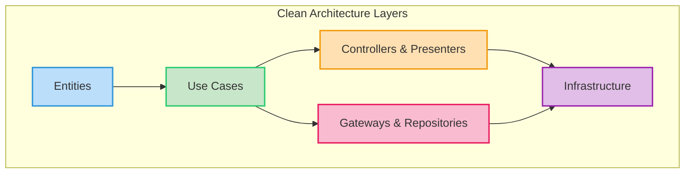

# Clean Architecture and Code Organization Plan

This document outlines a plan to evolve the application's architecture, focusing on adopting a more explicit Clean Architecture pattern for the backend and improving code organization for the frontend.

## 1. Backend: Implementing Clean Architecture

**Goal:** Fully adopt Clean Architecture principles to enhance testability, maintainability, and flexibility, especially as the application grows.

**Current State:** The backend already exhibits a layered structure with influences from Clean Architecture and Domain-Driven Design (DDD), particularly with `internal/domain/`, `internal/service/`, and `internal/repository/` interfaces.

**Key Changes & Refinements:**

The core idea of Clean Architecture is the "Dependency Rule": source code dependencies can only point inwards. Inner circles contain high-level policies, and outer circles contain low-level details.



Here's how the existing backend structure maps and what needs to be done:

### 1.1. Entities Layer (`backend/internal/domain/`)
*   **Purpose:** Contains the core business objects and rules. These are the most stable parts of the application and should have no dependencies on other layers.
*   **Current State:** Already well-defined with `Node` and `Category` models.
*   **Action:** Ensure this layer remains pure, containing only business entities and their associated logic. No database-specific annotations or web-framework-specific code should exist here.

### 1.2. Use Cases Layer (`backend/internal/service/`)
*   **Purpose:** Encapsulates the application-specific business rules. It orchestrates the flow of data to and from the Entities, and directs the Gateways (Repositories) to perform data operations.
*   **Current State:** This is where the main business logic resides.
*   **Action:**
    *   Ensure services here depend only on the `domain` layer and interfaces defined in `internal/repository/`.
    *   Avoid direct dependencies on `cmd/` (controllers) or concrete database implementations.
    *   Define clear input/output DTOs (Data Transfer Objects) for use cases if not already present, to decouple them from external data formats.

### 1.3. Gateways/Repositories Layer (Interfaces in `backend/internal/repository/`)
*   **Purpose:** Defines interfaces (contracts) for external data access (e.g., database operations, external API calls). These interfaces are implemented by the Infrastructure layer.
*   **Current State:** Likely contains interfaces for `NodeRepository`, `CategoryRepository`, etc.
*   **Action:**
    *   Verify that only interfaces are defined here.
    *   Ensure these interfaces are technology-agnostic.

### 1.4. External/Delivery Layer (`backend/cmd/`)
*   **Purpose:** Contains the "adapters" that expose the application's functionality to the outside world (e.g., HTTP handlers, WebSocket handlers, CLI commands). It translates external requests into calls to the Use Cases layer and formats responses.
*   **Current State:** Already contains `main` executables for various services.
*   **Action:**
    *   Ensure these handlers primarily focus on request parsing, validation, calling the appropriate Use Case, and formatting the response.
    *   They should depend only on the `internal/service` layer and `pkg/` utilities.

### 1.5. Infrastructure Layer (New: `backend/infrastructure/`)
*   **Purpose:** This is the new, explicit layer that will contain the concrete implementations of the Gateway/Repository interfaces defined in `internal/repository/`. It handles all external concerns like database connections, ORMs, external API clients, file system access, etc.
*   **Action:**
    *   **Create `backend/infrastructure/` directory.**
    *   Move all database-specific code (e.g., SQL queries, GORM/Ent setup, database connection logic) into this new directory.
    *   Implement the interfaces defined in `internal/repository/` within this layer. For example, `backend/infrastructure/postgres_node_repository.go` would implement `backend/internal/repository/node_repository.go` interface.
    *   This layer will depend on external libraries (database drivers, ORMs) and the `internal/domain` layer (to map data to entities).

### 1.6. Shared Utilities (`backend/pkg/`)
*   **Purpose:** Contains reusable components that don't fit into the core architectural layers but are used across multiple layers (e.g., common error types, configuration loading, shared API definitions).
*   **Current State:** Already exists with `api/`, `config/`, `errors/`.
*   **Action:** Continue to use this for truly cross-cutting concerns.

### Benefits of this Migration:
*   **Testability:** Use cases can be tested independently of the database.
*   **Maintainability:** Changes in database technology or web framework won't affect core business logic.
*   **Flexibility:** Easier to swap out external dependencies.
*   **Clarity:** Clearer separation of concerns and responsibilities.

## 2. Frontend: Improving Code Organization

**Goal:** Enhance code organization for better scalability, discoverability, and maintainability, moving towards a feature-based structure while retaining a layered approach within features.

**Current State:** The frontend uses a layered architecture (`components/`, `hooks/`, `services/`, `types/`). While good, large, flat directories can become unwieldy as the application grows.

**Key Changes & Proposed Structure:**

The primary improvement is to introduce a **feature-based organization** at the top level, while still applying layered principles *within* each feature.

```
frontend/src/
├── app/                  # Root application setup (App.tsx, routing, global layout)
├── common/               # Truly shared, generic components, hooks, utilities (e.g., Button, Modal, useDebounce)
├── features/             # All application features, organized by domain/feature
│   ├── auth/             # Authentication feature
│   │   ├── components/   # Auth-related UI components (Login, Register, AuthSection)
│   │   ├── hooks/        # Auth-related custom hooks (useAuth)
│   │   ├── api/          # Auth-related API calls (authClient.ts, or specific auth endpoints)
│   │   └── index.ts      # Barrel export for the auth feature
│   ├── memories/         # Memory management feature
│   │   ├── components/   # Memory-related UI (MemoryInput, MemoryList, GraphVisualization)
│   │   ├── hooks/        # Memory-related hooks (e.g., useMemories)
│   │   ├── api/          # Memory-related API calls (apiClient methods for nodes)
│   │   └── index.ts
│   ├── categories/       # Category management feature
│   │   ├── components/   # Category-related UI (CategoriesList, CategoryDetail)
│   │   ├── hooks/        # Category-related hooks (e.g., useCategories)
│   │   ├── api/          # Category-related API calls (apiClient methods for categories)
│   │   └── index.ts
│   └── ... (other features)
├── types/                # Centralized type definitions (generated-types.ts, global.d.ts, cytoscape-cola.d.ts, errors.ts)
├── main.tsx              # Application entry point
├── index.html            # Main HTML file
└── style.css             # Global styles
```

### 2.1. `app/` Directory
*   **Purpose:** Contains the top-level application setup, including the root `App.tsx` component, global routing (`react-router-dom` setup), and any global layout components.
*   **Action:** Move `App.tsx` here. Refactor global layout if it becomes complex.

### 2.2. `common/` Directory
*   **Purpose:** For truly generic, reusable components, hooks, and utilities that are not specific to any single feature. Examples include UI primitives (buttons, inputs, modals), general utility functions (date formatting, validation helpers), or generic hooks (e.g., `useLocalStorage`).
*   **Action:** Identify and move existing generic components/hooks from `components/` and `hooks/` into this new directory.

### 2.3. `features/` Directory (New)
*   **Purpose:** This will be the main organizational unit for most of the application's code. Each subdirectory within `features/` represents a distinct feature or domain (e.g., `auth`, `memories`, `categories`).
*   **Action:**
    *   Create `features/` directory.
    *   For each major domain/feature (Auth, Memories, Categories):
        *   Create a subdirectory (e.g., `features/auth/`).
        *   Move relevant components, hooks, and API calls into their respective sub-folders within the feature directory (e.g., `features/auth/components/`, `features/auth/hooks/`, `features/auth/api/`).
        *   Create an `index.ts` barrel file within each feature directory for easy imports.
    *   The `services/` directory can be renamed to `api/` within each feature, or `src/services/` can be kept for truly global API clients if they are not feature-specific. Given the current `apiClient.ts` and `authClient.ts` are quite global, they might remain in `src/services/` or be split into feature-specific API modules. For this plan, let's assume `src/services/` remains for global API clients, and `features/*/api/` would be for feature-specific API logic or data transformations.

### 2.4. `types/` Directory
*   **Purpose:** Centralized location for all TypeScript type definitions, including auto-generated types, global augmentations, and custom error types.
*   **Current State:** Already established and improved in previous steps.
*   **Action:** Continue to use this as the single source of truth for types.

### Benefits of this Organization:
*   **Discoverability:** Developers can quickly find all code related to a specific feature.
*   **Maintainability:** Changes to a feature are localized within its directory.
*   **Scalability:** Easier to add new features without cluttering existing directories.
*   **Team Collaboration:** Different teams or developers can work on separate features with fewer merge conflicts.
*   **Code Locality:** Components, hooks, and API calls related to a feature are co-located.

This plan provides a roadmap for a more robust and scalable architecture for both the backend and frontend.
